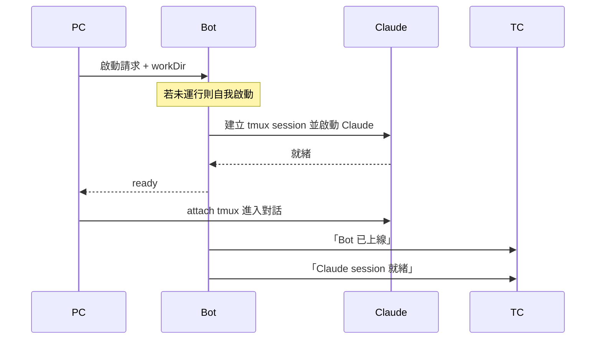

# Refactor Log — #166 架構重構

## 商業邏輯角色

- **PC** — tmux 終端介面
- **TC** — Telegram 介面
- **Bot** — 中間管家，程式進入點 / 主服務
- **Claude** — AI（被 Bot 持有的資源）

PC、TC 預設代表使用者操作。

---

## 場景：PC 啟動

### 設計觀察

Bot 不該直接呼叫 tmux 命令。應透過介面層讓底層實作可抽換成其他 AI CLI（gemini-cli、codex 等）或其他承載方式（直接 subprocess、其他 terminal multiplexer）。

現況：`ClaudePort` 介面已存在，但有 tmux 細節滲漏（watcher / pane 概念）需收乾淨。

---

## bot vs bot2 對照

bot2 是新架構平行實驗（DDD/Hexagonal），目前只完成 1/12 項，逐步補齊。

| 類別 | bot | bot2 | 主要依賴 |
|---|---|---|---|
| **啟動 Claude（new session）** | ✓ | ✓ | `ClaudeRunner`、tmux、`claudeParser`（hasPrompt / cleanAnsi）|
| Session resume | ✓ | ✗ | `sessionExists()`、`isClaudeRunning()`（pgrep）|
| Platform adapter | ✓ | ✗ | `LineAdapter` / `TelegramAdapter`、`PLATFORM` env、`AdapterDeps` |
| Send message | ✓ | ✗ | `SendMessageUseCase`、`Session` entity、`ClaudePort.run`、tmux send-keys |
| Watcher | ✓ | ✗ | `Watcher` 類別、`WatcherPort`、`capturePane` |
| Express HTTP server | ✓ | ✗ | `express`、`adapter.router`、`adapter.httpPort` |
| Unix socket（rai CLI） | ✓ | ✗ | `net.createServer`、`~/.rai/bot.sock`、`bin/client.mjs` |
| Signal handlers | ✓ | ✗ | `process.on(SIGINT/SIGTERM/SIGUSR1)`、`uncaughtException` |
| 上線 / 異常通知 push | ✓ | ✗ | `adapter.push` |
| SessionLogger | ✓ | ✗ | `~/.rai/logs/`、`SessionLogger` 類別 |
| 訊息分段（> 4000） | ✓ | ✗ | adapter 內部處理（LINE / Telegram） |
| currentWorkDir 管理 | ✓ | ✗ | module 變數、socket `start:workDir` |
