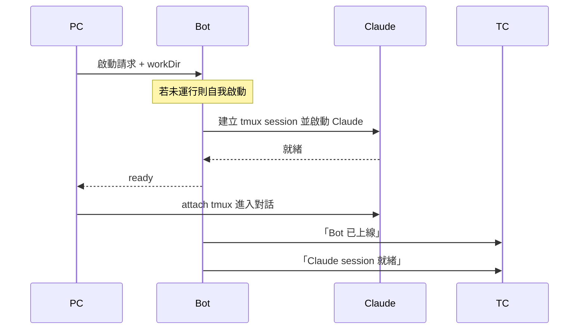

# Refactor Log — #166 架構重構

## 商業邏輯角色

- **PC** — tmux 終端介面
- **TC** — Telegram 介面
- **Bot** — 中間管家，程式進入點 / 主服務
- **Claude** — AI（被 Bot 持有的資源）

PC、TC 預設代表使用者操作。

---

## 場景：PC 啟動

### 設計觀察

Bot 不該直接呼叫 tmux 命令。應透過介面層讓底層實作可抽換成其他 AI CLI（gemini-cli、codex 等）或其他承載方式（直接 subprocess、其他 terminal multiplexer）。

現況：`ClaudePort` 介面已存在，但有 tmux 細節滲漏（watcher / pane 概念）需收乾淨。

---

## bot vs bot2 對照

bot2 是新架構平行實驗（DDD/Hexagonal），目前只完成 1/12 項，逐步補齊。

| 類別 | bot | bot2 | 主要依賴 |
|---|---|---|---|
| **啟動 Claude（new session）** | ✓ | ✓ | `ClaudeRunner`、tmux、`claudeParser`（hasPrompt / cleanAnsi）|
| Session resume | ✓ | ✗ | `sessionExists()`、`isClaudeRunning()`（pgrep）|
| Platform adapter | ✓ | ✗ | `LineAdapter` / `TelegramAdapter`、`PLATFORM` env、`AdapterDeps` |
| Send message | ✓ | ✗ | `SendMessageUseCase`、`Session` entity、`ClaudePort.run`、tmux send-keys |
| Watcher | ✓ | ✗ | `Watcher` 類別、`WatcherPort`、`capturePane` |
| Express HTTP server | ✓ | ✗ | `express`、`adapter.router`、`adapter.httpPort` |
| Unix socket（rai CLI） | ✓ | ✗ | `net.createServer`、`~/.rai/bot.sock`、`bin/client.mjs` |
| Signal handlers | ✓ | ✗ | `process.on(SIGINT/SIGTERM/SIGUSR1)`、`uncaughtException` |
| 上線 / 異常通知 push | ✓ | ✗ | `adapter.push` |
| SessionLogger | ✓ | ✗ | `~/.rai/logs/`、`SessionLogger` 類別 |
| 訊息分段（> 4000） | ✓ | ✗ | adapter 內部處理（LINE / Telegram） |
| currentWorkDir 管理 | ✓ | ✗ | module 變數、socket `start:workDir` |

---

## 待議

### 三個檔的層次歸屬（bot2.ts / daemon-entry.ts / client.ts）

DDD 沒原生「entry point」層概念，三個檔的真實角色：

| 檔 | 角色 |
|---|---|
| `bot2.ts` | Composition root + client 進程 entry |
| `daemon-entry.ts` | Composition root + daemon 進程 entry |
| `client.ts` | 互動 UI 邏輯（被 bot2 呼叫） |

候選歸屬：
- A. 全放 `src/presentation/`（名實不符，daemon 沒 UI）
- B. 全放 `src/main/`（務實但非 DDD 用語）
- C. 拆兩處：bot2 + daemon-entry 放 `src/` 根（跟 composition.ts 同層）；client.ts 留 `src/presentation/`

暫不決，先繼續實作。

---

## 決定：商業需求對齊（2026-05-17）

繞太多技術名詞後回到商業根本，核心角色簡化為：

| 角色 | 商業意義 |
|---|---|
| 使用者 | 從 PC 或 TC 進來 |
| AI 對話階段 | 一段持續的 Claude + 對話歷史（tmux session `claude-reach`） |
| Bot | 管 AI 對話階段、跟 PC/TC 通訊的中介（常駐 daemon 進程） |
| Client | PC 端互動工具進程（跑完即退） |

Bot ↔ Client 透過 Unix socket 通訊（典型 client-server）。

## 決定：Daemon 用一個 class，不分 listener / handler（2026-05-17）

### 背景

原本設計過 `CMDListener` port + `UnixSocketCMDListener` adapter + handler 注入。多輪討論後發現對小專案是過度設計：

- 拆 listener/handler 的核心好處是「可換通訊方式」（換 HTTP、queue）
- 我們只用 socket、可預見的未來不會換
- 抽象成本（多檔案、handler 註冊概念）大於收益

### 結果

**砍掉** `CMDListener.ts`，**合併**成單一 `Daemon` class：

| 檔 | 角色 |
|---|---|
| `src/application/Daemon.ts` | 持有 socket server，dispatch 命令；public `start()` / `close()` |
| `src/presentation/daemon-entry.ts` | daemon 進程入口，三行：new、start、signal handler |

`composition.ts` 只 export adapter（cliRunner），不負責 new Daemon——由 daemon-entry 自己 new（避免 composition 因為新增業務物件而動）。

### 取捨記錄

- 失去「換通訊方式」的彈性（換 HTTP 要改 Daemon 內部）
- 換回直觀（一個 class、一個 start/close 動作）
- 未來真需要切換，再回頭抽 port

## 待續

- `Daemon.dispatch` 內目前 echo placeholder，info / start 命令邏輯待從 bot.ts 抄入
- `BotConnection` (client 端 port) 跟 `UnixSocketBotConnection` 還沒寫
- bot2.ts 還沒寫成「使用者入口 + spawn daemon + 互動」
