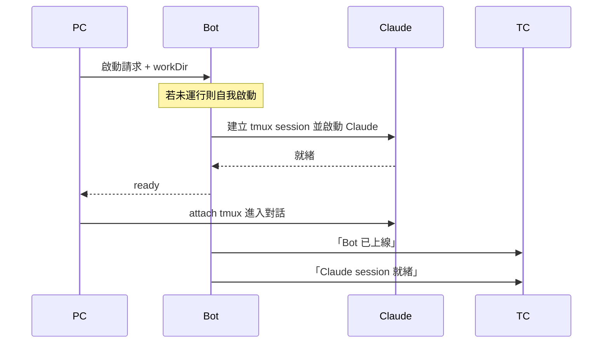

# Refactor Log — #166 架構重構

## 商業邏輯角色

- **PC** — tmux 終端介面
- **TC** — Telegram 介面
- **Bot** — 中間管家，程式進入點 / 主服務
- **Claude** — AI（被 Bot 持有的資源）

PC、TC 預設代表使用者操作。

---

## 場景：PC 啟動

### 設計觀察

Bot 不該直接呼叫 tmux 命令。應透過介面層讓底層實作可抽換成其他 AI CLI（gemini-cli、codex 等）或其他承載方式（直接 subprocess、其他 terminal multiplexer）。

現況：`ClaudePort` 介面已存在，但有 tmux 細節滲漏（watcher / pane 概念）需收乾淨。

---

## bot vs bot2 對照

bot2 是新架構平行實驗（DDD/Hexagonal），目前只完成 1/12 項，逐步補齊。

| 類別 | bot | bot2 | 主要依賴 |
|---|---|---|---|
| **啟動 Claude（new session）** | ✓ | ✓ | `ClaudeRunner`、tmux、`claudeParser`（hasPrompt / cleanAnsi） |
| Session resume | ✓ | ✗ | `sessionExists()`、`isClaudeRunning()`（pgrep） |
| Platform adapter | ✓ | ✗ | `LineAdapter` / `TelegramAdapter`、`PLATFORM` env、`AdapterDeps` |
| Send message | ✓ | ✗ | `SendMessageUseCase`、`Session` entity、`ClaudePort.run`、tmux send-keys |
| Watcher | ✓ | ✗ | `Watcher` 類別、`WatcherPort`、`capturePane` |
| Express HTTP server | ✓ | ✗ | `express`、`adapter.router`、`adapter.httpPort` |
| Unix socket（rai CLI） | ✓ | ✗ | `net.createServer`、`~/.rai/bot.sock`、`bin/client.mjs` |
| Signal handlers | ✓ | ✗ | `process.on(SIGINT/SIGTERM/SIGUSR1)`、`uncaughtException` |
| 上線 / 異常通知 push | ✓ | ✗ | `adapter.push` |
| SessionLogger | ✓ | ✗ | `~/.rai/logs/`、`SessionLogger` 類別 |
| 訊息分段（> 4000） | ✓ | ✗ | adapter 內部處理（LINE / Telegram） |
| currentWorkDir 管理 | ✓ | ✗ | module 變數、socket `start:workDir` |

---

## 待議

### 三個檔的層次歸屬（bot2.ts / daemon-entry.ts / client.ts）

DDD 沒原生「entry point」層概念，三個檔的真實角色：

| 檔 | 角色 |
|---|---|
| `bot2.ts` | Composition root + client 進程 entry |
| `daemon-entry.ts` | Composition root + daemon 進程 entry |
| `client.ts` | 互動 UI 邏輯（被 bot2 呼叫） |

候選歸屬：
- A. 全放 `src/presentation/`（名實不符，daemon 沒 UI）
- B. 全放 `src/main/`（務實但非 DDD 用語）
- C. 拆兩處：bot2 + daemon-entry 放 `src/` 根（跟 composition.ts 同層）；client.ts 留 `src/presentation/`

暫不決，先繼續實作。

---

## 決定：商業需求對齊（2026-05-17）

繞太多技術名詞後回到商業根本，核心角色簡化為：

| 角色 | 商業意義 |
|---|---|
| 使用者 | 從 PC 或 TC 進來 |
| AI 對話階段 | 一段持續的 Claude + 對話歷史（tmux session `claude-reach`） |
| Bot | 管 AI 對話階段、跟 PC/TC 通訊的中介（常駐 daemon 進程） |
| Client | PC 端互動工具進程（跑完即退） |

Bot ↔ Client 透過 Unix socket 通訊（典型 client-server）。

## 決定：Daemon 用一個 class，不分 listener / handler（2026-05-17）

### 背景

原本設計過 `CMDListener` port + `UnixSocketCMDListener` adapter + handler 注入。多輪討論後發現對小專案是過度設計：

- 拆 listener/handler 的核心好處是「可換通訊方式」（換 HTTP、queue）
- 我們只用 socket、可預見的未來不會換
- 抽象成本（多檔案、handler 註冊概念）大於收益

### 結果

**砍掉** `CMDListener.ts`，**合併**成單一 `Daemon` class：

| 檔 | 角色 |
|---|---|
| `src/application/Daemon.ts` | 持有 socket server，dispatch 命令；public `start()` / `close()` |
| `src/presentation/daemon-entry.ts` | daemon 進程入口，三行：new、start、signal handler |

`composition.ts` 只 export adapter（cliRunner），不負責 new Daemon——由 daemon-entry 自己 new（避免 composition 因為新增業務物件而動）。

### 取捨記錄

- 失去「換通訊方式」的彈性（換 HTTP 要改 Daemon 內部）
- 換回直觀（一個 class、一個 start/close 動作）
- 未來真需要切換，再回頭抽 port

## 進度（2026-05-20）

### A 路徑（PC 端閉環）— 完成

- `BotConnection` port + `UnixSocketBotConnection` adapter
- `bot2.ts` 改寫為 daemon spawn + 互動 client
- `isAlive()` 從 `info()` 拆出來，純連線探測（不送命令）
- `Daemon.dispatch` 落實 info / start 命令

### B 路徑（TC 接通）— 主體完成

| 新增 | 角色 |
|---|---|
| `CLIPaneIO` (port) | 互動式 CLI 雙向通訊（`send` / `onMessage`） |
| `BotPort` (port) | 對話 bot 平台抽象 |
| `ClaudeRunner2` (adapter) | 同時實作 `CLIRunner` + `CLIPaneIO` |
| `TelegramBot` (adapter) | `BotPort` 的 Telegram 實作（grammY） |
| `ConversationMirror` (service) | TC ↔ CLI 雙向 mirror |
| `claudeParser.extractLastExchange` | 抽取最後一輪對話對（去 banner / cook timer / 輸入框） |
| `logger.ts` | 集中 logger |
| `config.ts` | 集中常數（SOCKET_PATH / TMUX_SESSION / CLAUDE_BIN） |

**移除**：`Watcher` / `WatcherPort` / `Watcher.test`（被 `ConversationMirror` + `ClaudeRunner2.onMessage` 取代）

### Code Review 進度

| 檔 | 狀態 |
|---|---|
| `CLIPaneIO.ts` | ✅ 改名 + 方法名 + 註解通用化 |
| `ChatPort.ts`（原 `BotPort.ts`） | ✅ 改名 + push→send + 去 TC + 4096 下沉到實作 |
| `ClaudeRunner2.ts` | 🟡 magic number 抽完；P0（v1 dead code + 改名）/ P2（onMessage side effect、邏輯重複）待 |
| `TelegramBot.ts` | ✅ 訊息分段下沉 + fire-and-forget `.catch(log)` + onMessage 就地註冊 grammY listener |
| `ConversationMirror.ts` / `.test.ts` | ✅ `claudeIO` → `cliIO`、`BotPort` → `ChatPort` 連帶改完；內部 `Claude` 字眼待議 |
| `daemon-entry.ts` | ✅ `cliPaneIO` 連帶改名 |
| `composition.ts` | ✅ `ChatPort` + `CLIPaneIO` 連帶改名 |
| `claudeParser.ts` / `logger.ts` / `config.ts` | ⏳ 未開始 |

### 命名決議

- `ClaudePaneIO` → `CLIPaneIO`：介面層不綁特定 CLI（claude / gemini / codex 都可實作）
- 方法名採對話模型：`sendInput`/`onOutput` → `send`/`onMessage`；兩個 port 對稱
- `BotPort.push` → `BotPort.send`：跟 CLIPaneIO 對稱
- `BotPort` 介面層去 TC 縮寫；TC/PC 全 codebase 退場排在 **舊 code（`bot.ts`）退場後**（路徑 B 待辦）
- `BotPort` → `ChatPort`：介面層去 Bot 字眼（89fd328）

## 進度（2026-05-23）

舊 bot.ts 流程整套退場（commit `6d392a3`）：刪 `bot.ts` / `TmuxClaudeAdapter` / `ClaudeRunner` v1 / `presentation/platforms/*` / use-cases / domain / SessionLogger / 舊 env helper。連帶刪 `docs/architecture/architecture.md` + `modules.md`（描述舊架構），README / CLAUDE.md surgical edit。

連帶解鎖（從待續移出）：
- ClaudeRunner2 P0：v1 dead code 已隨舊 code 一起退場；ClaudeRunner2 → ClaudeRunner 改名亦完成
- TC/PC 縮寫全 codebase 退場、`presentation/` → `infrastructure/` 遷移
- `claudeParser` 整進 Runner、`CLAUDE_BIN` inline、`config.ts` 瘦身

## 待續

- TC/PC 縮寫全 codebase 退場、`presentation/` → `infrastructure/` 遷移（依新 conventions）
- `conventions.md` Q1 / Q2 拍板（composition.ts 與 daemon-entry.ts 歸屬，截止 2026-05-22）
- `ClaudeRunner.tmux()` 用 `execSync` 預設 `stderr: 'inherit'`，tmux session 不存在時 polling 把 `no server running` 噴到 console；改 `stdio: ['pipe', 'pipe', 'pipe']` 或 `pollOnce` 內加 `sessionExists()` 早退（低優先）
- **application service 是否進 composition / 提供 factory（稍後優先處理）**：`ConversationMirror` / `Daemon` 等 service 目前 `daemon-entry` 自己 new，跟 port-adapter 都在 composition 不對稱。usage 不足先記（只有 1-2 個 service），等更多 service 出現再決定要不要把 wiring 集中到 composition
- `claudeParser` 整進 `ClaudeRunner.ts`（同檔 file-scope function），刪 `claudeParser.ts` + `.test.ts`；`CLAUDE_BIN` 常數 inline 到 Runner 內。`config.ts` 只留 daemon ↔ client 共用契約值（`TMUX_SESSION` / `SOCKET_PATH`）
- **ConversationMirror 不合進 TelegramBot**：逐段拆解後內無 Telegram-specific 邏輯，剝 user 行決策是線性 chat 通用特性；唯一非通用是 `❯ ` 偵測（Claude CLI 規格），未來該下沉到 `CLIPaneIO` adapter 讓 emit 已結構化（2026-05-23 結論）
